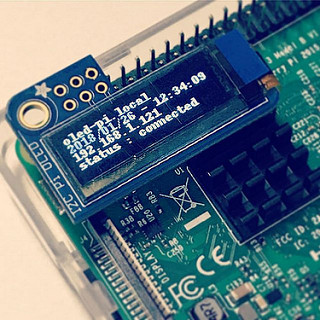

redis-ssd1306.py
====
Display driver program for Adafruit PiOLED (https://www.adafruit.com/product/3527)

* 

Setup
----

    # see also... https://learn.adafruit.com/adafruit-pioled-128x32-mini-oled-for-raspberry-pi/usage
    $ sudo apt-get update
    $ sudo apt-get install build-essential python-dev python-pip
    $ sudo pip install RPi.GPIO
    $ sudo apt-get install python-imaging python-smbus
    $ git clone https://github.com/adafruit/Adafruit_Python_SSD1306.git
    $ cd Adafruit_Python_SSD1306
    $ sudo python setup.py install

    $ sudo apt-get install redis-server redis-tools
    $ sudo pip install redis

    $ mkdir ~/work
    $ cd ~/work
    $ git clone https://github.com/yoggy/redis-ssd1306.py.git
    $ cd ./redis-ssd1306.py/

    # exec in the foreground
    $ python redis-ssd1306.py

    # for supervisor
    $ sudo cp redis-ssd1306.conf.sample /etc/supervisor/conf.d/
    $ sudo vi /etc/supervisor/conf.d/redis-ssd1306.conf
    $ sudo supervisorctl reread
    $ sudo supervisorctl add redis-ssd1306

How to display messages
----

    $ redis-cli set "oled:0" `hostname`
    $ redis-cli set "oled:1" `date "+%Y/%m/%d-%H:%M:%S"`
    $ redis-cli set "oled:2" `LANG=C /sbin/ifconfig | grep -v 127.0.0.1 | grep inet | awk '{print $2}' | sed -e 's/addr://' | head -1`

pyright and license
----
Copyright (c) 2018 yoggy

Released under the [MIT license](LICENSE.txt)

